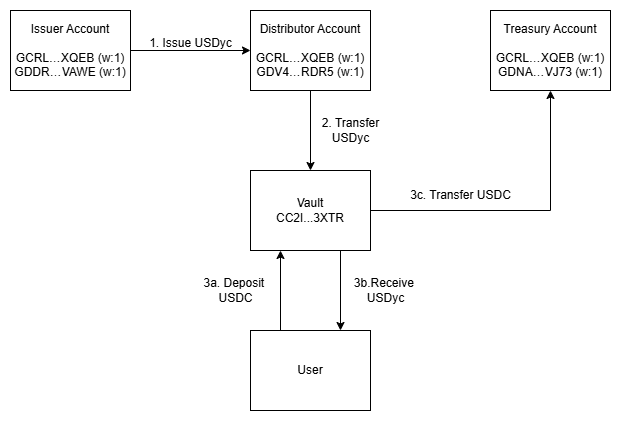

# Untangled Vault

This Rust crate implements a contract for managing token offers and facilitating trades between tokens. This README provides an overview of the contract's main functions.

## Overview

This Rust-based Soroban smart contract implements a token vault system that allows users to securely store tokens, create offers for token trading, and manage token redemption requests. The contract ensures secure and transparent operations, supporting features like deposits, withdrawals, price updates, and epoch-based settlements.

## Project Structure

```text
.
├── contracts
│   └── vault
│       ├── src
│       │   ├── vault.rs       # Main implementation of the Vault contract
│       │   ├── offer.rs       # Module for managing offers
│       │   ├── redeem_request.rs # Module for handling redemption requests
│       │   ├── storage_types.rs  # Definitions for storage keys and data structures
│       │   └── test.rs        # Unit tests for the Vault contract
│       └── Cargo.toml         # Rust package configuration for the Vault contract
├── Cargo.toml                 # Root Rust package configuration
└── README.md                  # Project documentation
```

## Overall Architecture



## Overview

The Vault contract provides the following key functionalities:

- **Token Vault Management:** Securely store and manage tokens.
- **Token Trading Offers:** Create, update, and manage token trading offers.
- **Redemption Requests:** Handle token redemption requests and settlements.
- **Epoch Settlements:** Manage epochs for redeeming tokens and transferring assets.

## Functions

### 1. `initialize`

**Purpose:** Initialize the vault with an offer.

**Parameters:**

- `e: Env` - The contract environment.
- `seller: Address` - The address of the seller creating the offer.
- `treasury: Address` - The address where funds will be sent.
- `sell_token: Address` - The token being offered for sale.
- `buy_token: Address` - The token to be received in exchange.
- `sell_price: u32` - The price of one unit of `sell_token` in terms of `buy_token`.
- `buy_price: u32` - The price of one unit of `buy_token` in terms of `sell_token`.

**Restrictions:**

- The offer must not already exist.
- Prices cannot be zero.
- The seller must authorize the initialization.

---

### 2. `deposit`

**Purpose:** Deposit the `buy_token` and receive the corresponding `sell_token`.

**Parameters:**

- `e: Env` - The contract environment.
- `buyer: Address` - The address of the buyer.
- `buy_token_amount: i128` - The amount of `buy_token` to deposit.
- `min_sell_token_amount: i128` - The minimum amount of `sell_token` expected in return.

**Restrictions:**

- The buyer must authorize the deposit.
- The calculated `sell_token` amount must meet or exceed `min_sell_token_amount`.

---

### 3. `claim_leftover`

**Purpose:** Allow the seller to claim leftover tokens from the vault.

**Parameters:**

- `e: Env` - The contract environment.
- `token: Address` - The token to be claimed.
- `amount: i128` - The amount of tokens to claim.

**Restrictions:**

- Only the seller can claim leftover tokens.

---

### 4. `updt_price`

**Purpose:** Update the price of the offer.

**Parameters:**

- `e: Env` - The contract environment.
- `sell_price: u32` - The new selling price.
- `buy_price: u32` - The new buying price.

**Restrictions:**

- Prices cannot be zero.
- Only the seller can update the price.

---

### 5. `redeem_request`

**Purpose:** Submit a request to redeem shares.

**Parameters:**

- `e: Env` - The contract environment.
- `sender: Address` - The address of the user submitting the request.
- `amount: i128` - The amount of shares to redeem.

**Restrictions:**

- The sender must authorize the request.
- If a previous request exists for an earlier epoch, it must be claimed first.

---

### 6. `cancel_request`

**Purpose:** Cancel a redemption request and return the shares to the sender.

**Parameters:**

- `e: Env` - The contract environment.
- `sender: Address` - The address of the user canceling the request.

**Restrictions:**

- The sender must authorize the cancellation.
- The request must exist and have a positive share amount.

---

### 7. `claim_request`

**Purpose:** Claim the redeemed tokens after the epoch is settled.

**Parameters:**

- `e: Env` - The contract environment.
- `sender: Address` - The address of the user claiming the request.

**Restrictions:**

- The sender must authorize the claim.
- The epoch must be settled before the claim can be processed.

---

### 8. `setle_epoch`

**Purpose:** Settle the current epoch and transfer the `buy_token` to the treasury.

**Parameters:**

- `e: Env` - The contract environment.

**Restrictions:**

- Only the treasury can authorize the settlement.

---

### 9. `get_offer`

**Purpose:** Retrieve the current offer details.

**Parameters:**

- `e: Env` - The contract environment.

**Returns:** The `Offer` structure containing all relevant details.

---

### 10. `get_request`

**Purpose:** Retrieve the redemption request for a specific user.

**Parameters:**

- `e: Env` - The contract environment.
- `sender: Address` - The address of the user.

**Returns:** The `RedeemRequest` structure for the user.

---

### 11. `get_epoch_id`

**Purpose:** Retrieve the current epoch ID.

**Parameters:**

- `e: Env` - The contract environment.

**Returns:** The current epoch ID as a `u32`.

---

### 12. `get_total_redeem`

**Purpose:** Retrieve the total redeem amount for the current epoch.

**Parameters:**

- `e: Env` - The contract environment.

**Returns:** The total redeem amount as an `i128`.

---

### 13. `get_redeem_rate`

**Purpose:** Retrieve the redeem rate for a specific epoch.

**Parameters:**

- `e: Env` - The contract environment.
- `epoch_id: u32` - The ID of the epoch.

**Returns:** The redeem rate as a `u32`.

---

## Usage

1. **Initialize Vault:** Use the `initialize` function to set up the vault with an offer.
2. **Deposit Tokens:** Buyers can deposit tokens using the `deposit` function.
3. **Claim Leftovers:** Sellers can claim leftover tokens with the `claim_leftover` function.
4. **Update Price:** Sellers can update the offer price using the `updt_price` function.
5. **Redeem Shares:** Users can submit redemption requests with the `redeem_request` function.
6. **Cancel Requests:** Users can cancel redemption requests using the `cancel_request` function.
7. **Claim Requests:** Users can claim redeemed tokens after the epoch is settled using the `claim_request` function.
8. **Settle Epoch:** The treasury can settle the epoch using the `setle_epoch` function.

## Testing

The contract includes comprehensive tests in the `test.rs` file, covering all major functionalities such as initialization, deposits, withdrawals, price updates, and epoch settlements.

---

This contract is designed to provide secure and transparent token management. It ensures that all operations are authorized and that no party can perform actions without proper permissions. Proper use of this contract requires familiarity with the Soroban SDK and token transfer mechanisms.
